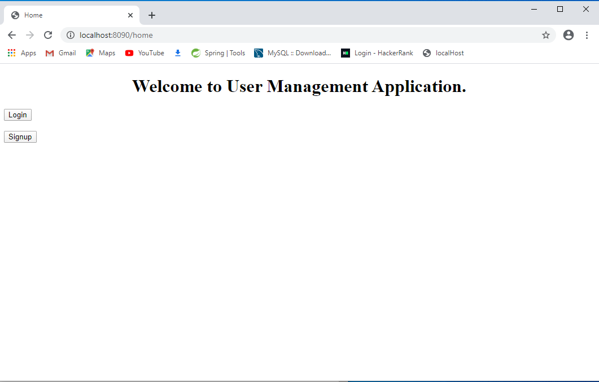
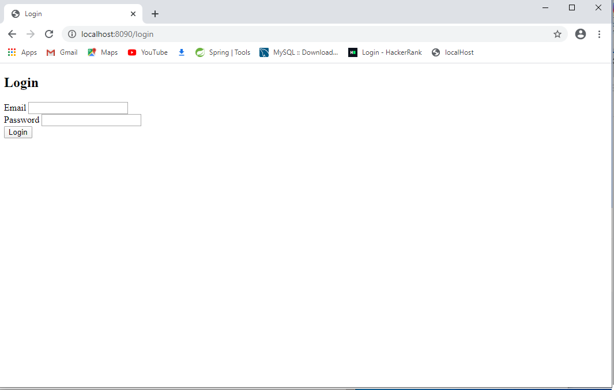
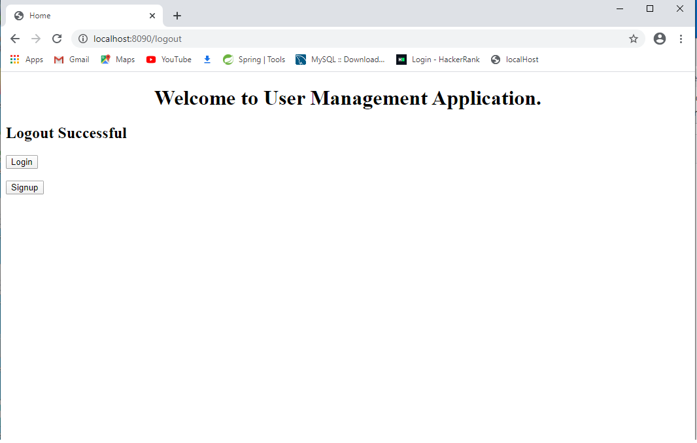

#User-Management Spring Boot Application

##Api's
* Home API
"http://localhost:8090/home" or "http://localhost:8090/"

* Signup API
"http://localhost:8090/signup"

* Login API
"http://localhost:8090/login"

* Dummy API
"http://localhost:8090/dummy"

* Logout API
"http://localhost:8090/logout"

** 1.Home Page
"http://localhost:8090/home" or "http://localhost:8090/"

** 2.Signup API:
"http://localhost:8090/signup"

** 3.Login API
"http://localhost:8090/login"

** 4.Dummy API
"http://localhost:8090/dummy"

** 5.Logout page API
"http://localhost:8090/logout"

